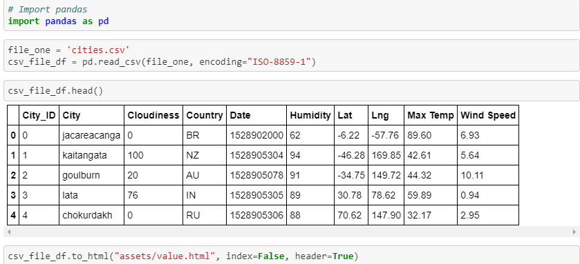

# Project: Webpage using HTML, CSS with Bootstrap

This project had the purpose of creating a web dashboard using HTML and CSS3 enhanced with Bootstrap. Be aware that the text filled in this project was a dummy text generated by this [page](https://www.lipsum.com/). 

## CSS in action:

1. All pages were developed to resize layout, which means, based on the browser size, the page shows a different layout.
1. Besides Boostrap there is another style.css which gives more personality for this web dashboard

## Publish:

This project was published using Github for web, and to access this dashboard click [here](https://manoelbritto.github.io/Web-Visualization-Dashboard/index.html)

## Converting CSV into HTML

The easy way to convert a CSV into HTML is using python with pandas, and below I show the code sample:

## Webpages Layout

**Webpage when the browser is in the desktop layout:**

**Menu** 

**Webpage page when the browser is in tablet layout:**

**Webpage page when the browser is in smartphone layout:**

## Features:
* HTML
* CSS with Bootstrap 4
* Jupyter Notebook
  * Python with Pandas
